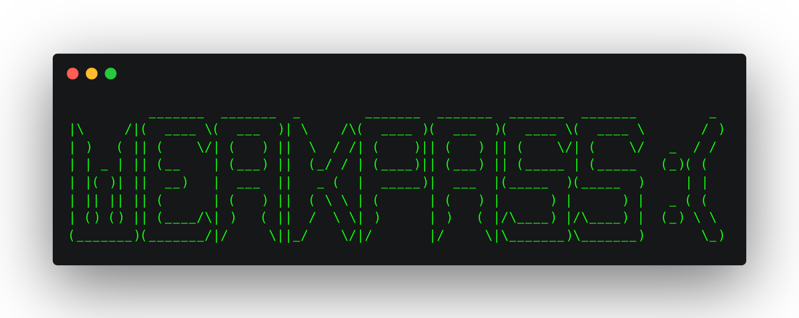

<div align="center">
  

</div>

## 
`weakpass` is a basic script that automates the generation of weak and standardized passwords. Designed to be a simple but valuable tool during the initial phase of security tests.

## Installation 

```sh
go install github.com/phor3nsic/weakpass@latest
```

## Usage 

To get a list of options:

```sh
weakpass -h
```

Example for a small list focused on a web spraying attack:
```sh
weakpass -c microsoft -w 
```

Example for a big list focused on brute force cracking (eg: hashcat):
```sh
weakpass -c microsoft -b -o mscrack.txt 
```

Example for multi companies:
```sh
weakpass -c microsoft,xbox,skype -b -o mscrack.txt -silent
```

<div align="center">

</div>
